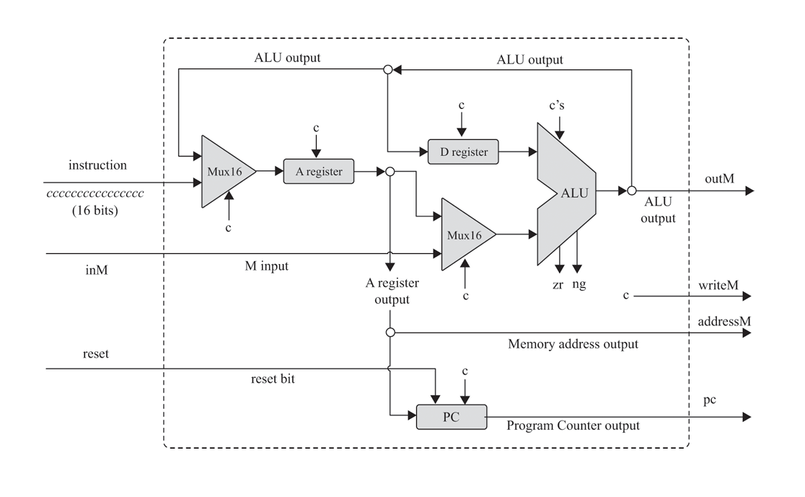

# Nand2Tetris

This repository contains my implementation of the [Nand2Tetris](https://mitpress.mit.edu/9780262140874/) course, building a functional computer system from ground up. The project is divided into two main parts: hardware and software construction. Each project builds upon the previous ones, culminating in a fully functioning computer system capable of running a Tetris game.

## Table of Contents

1. [Project 1: Boolean Logic](#project-1-boolean-logic)
2. [Project 2: Boolean Arithmetic](#project-2-boolean-arithmetic)
3. [Project 3: Sequential Logic](#project-3-sequential-logic)
4. [Project 4: Machine Language](#project-4-machine-language)
5. [Project 5: Computer Architecture](#project-5-computer-architecture)
6. [Project 6: Assembler](#project-6-assembler)
7. [Project 7 & 8: Virtual Machine I & II](#project-7--8-virtual-machine-i--ii)
9. [Project 9 & 10: Compiler I & II](#project-9--10-compiler-i--ii)
11. [Project 11: Operating System](#project-11-operating-system)

## Project 1: Boolean Logic

Implemented the basic building blocks of digital circuits using just the elementary NAND gate. The components include elementary logic gates like NOT, AND, OR, Multiplexers and Demultiplexers, as well as their Multi-Bit / Multi-Way versions.

## Project 2: Boolean Arithmetic

Designed and implemented components capable of boolean arithmetic including Incrementer, Half-Adder, Full-Adder and a 16-bit Adder, leading to an ALU (Arithmetic Logic Unit) capable of performing basic arithmetic and logic operations.

## Project 3: Sequential Logic

Used flip-flops and Sequential logic circuits to build a set of registers and memory devices, leading up to a 256Kb RAM (16K 16-bit registers).

## Project 4: Machine Language

Learnt the principles of machine language and wrote some programs in assembly language. This project provided insight into how high-level code is translated into machine code that the computer can execute directly.

  
   
  <em>Hack Instruction Set</em>

## Project 5: Computer Architecture

Combining all previous chips, constructed Hack, a general-purpose 16-bit computer. Some features of Hack - 

- A 16-bit von Neumann machine designed to execute programs written in Hack Machine Laguage (Project 4).
- Consists of a CPU, two separate memory modules serving as instruction memory and data memory, and two memory mapped I/O devices: a screen and a keyboard.
- The CPU consists of an ALU and three registers: Data Register (D), Address Register (A), and Program Counter (PC).
- 512 Kb Data Memory (RAM), with 256 Kb available for use, the rest reserved for I/O devices like Screen.
- 512 Kb Instruction Memory (ROM).

  
   
  <em>Hack CPU</em>

  
   
  <em>Hack Computer Architecture</em>

## Project 6: Assembler

Developed a two-pass assembler in C++ that translates assembly language programs into binary machine code. This binary machine code can be directly stored in the instruction memory (ROM) to run programs on Hack Computer. 

The assembler uses a symbol-table to handle labels, variables and pre-defined symbols.

## Project 7 & 8: Virtual Machine I & II

Implemented a JVM-like virtual machine in C++. As with Java and C#, the overall Jack compiler is based on two tiers: a virtual machine (VM) back end that translates VM commands into machine language and a front end compiler that translates Jack programs into VM code. This abstraction layer is called virtualization and it simplifies program translation and execution.

The interim VM code is based on stack-based automata that can be fairly easily translated to assembly. The VM translator implemented in this project is capable of handling function calls, recursion, and more complex control structures. Consequently, it can translate any program written in Jack programming language to VM code.

## Project 9 & 10: Compiler I & II

The constructor of compiler is divided into 2 parts: tokenizing and code generation. Refer to [Compiler Notes](./compiler/README.md).

## Project 12: Operating System

The final project involves building a basic operating system for the Hack computer. This operating system includes essential services like memory management, input/output handling, and process management. With an OS, Hack is now a fully functional computer system capable of running complex applications like a Tetris game.

## Acknowledgments

- Noam Nisan and Shimon Schocken for creating the Nand2Tetris course and textbook.
- The Nand2Tetris community for their support and resources.
