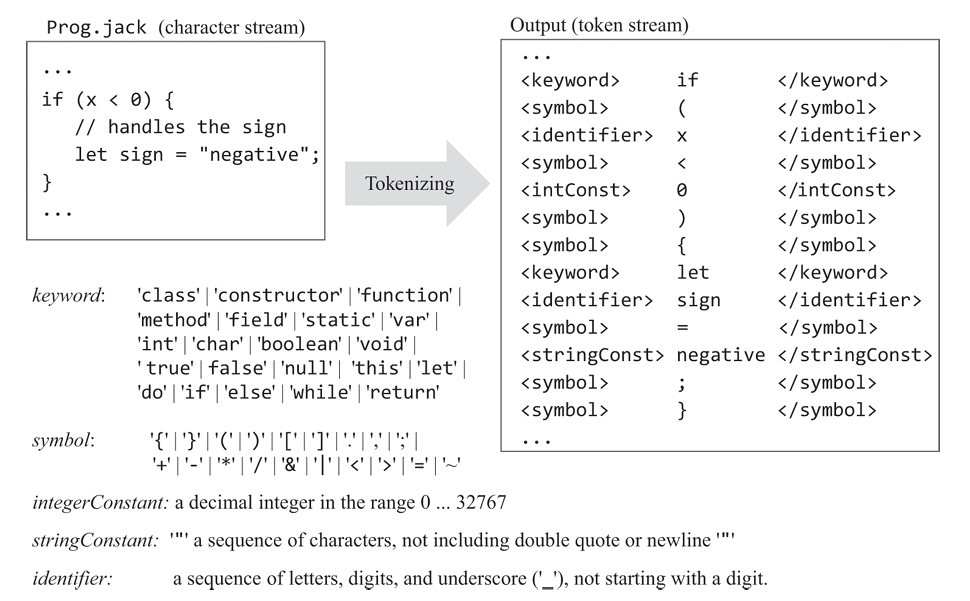
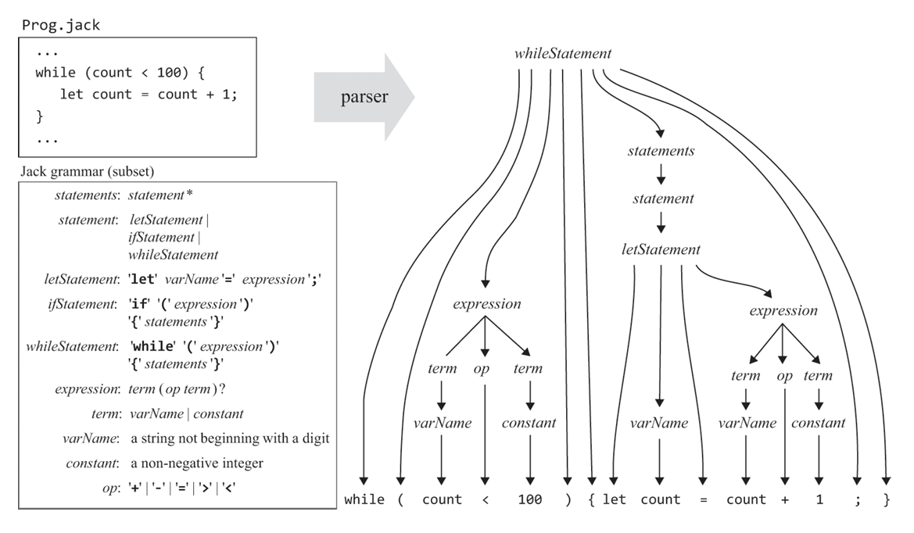

# Jack Compiler

Compilation consists of two main stages: _syntax analysis_ and _code generation_.

## Syntax Analysis
The job of syntax analyzer is to understand the structure of the program. It is further divided into two substages: _tokenizing_ and _parsing_.

In order for a program to be valid, it must follow a _grammar_ - the set of rules that define the the syntax of a programming language. Parsing a given program means to determine the exact correspondence between the program's text and the grammar's rules. In order to do so, we must first break the program in a list of tokens.

### Lexical Analysis (Tokenizing)

Each programming language includes types of tokens or lexical categories. These tokens are referred as the language _lexicon_.

The first step in analyzing the syntax of a program is grouping the characters into tokens, ignoring white spaces and comments. This is called Lexical Analysis, scanning, or tokenizing. 

<p align="center">
  
  <br>
  <em>Lexical Analysis</em>
</p>

A tokenizer is implemented by simulating a finite state machine, going over the entire program character-by-character. The output is a set of tokens, which are fed into the parser.

### Parser

The next step is to group (or parse) the tokens into valid sentences. A parser operates according to a given grammar. Context Free Grammars (CFGs) are usually used to describe a programming language. This grammar can be used to ascertain, without ambiguity, whether given program is valid syntactically or not. 

The parser accepts as input a stream of tokens and attempts to produce as output a data struture called _parse tree_. If such a tree can be generated, the parser renders the input valid; otherwise, it reports a syntax error. 

<p align="center">
  
  <br>
  <em>Parse Tree of a typical code segment following the grammar rules.</em>
</p>

CFGs are inherently recursive. So, we use a top-down recursive approach, known as _recusive descent parsing_, to construct a parse tree. Basically, the parser has one function to handle each non-trivial rule in the grammar. It then uses the nested structure of the grammar to parse recursively.

Jack Language is mostly LL(1), barring a few cases, meaning it requires just one lookahead token to determine which rule to use next. 

In this project, the parser represents the parse tree as XML file. The next module, code generation, will directly generate VM code and will skip this intermediate step of generating XML file.

## Semantic Analysis & Code Generation

To convert the parse tree into VM Code, we need to handle Variables, Expressions, Control Flow, Strings, Objects and Arrays.

### Variables 

Consider a high-level statement - 
```
let y = y + dy
```
The corresponding VM commands should be -
```
push y
push dy
add
pop y
```
Now, the VM does not understand variable names. So, what we need to determine the type of the variable (int, bool, object, string, array) and its kind (static, field, argument, local). We also need its index within its kind. With that information we can generate VM code that looks like -
```
push local 0
push argument 1
call add 2
pop local 0
```
We only need to map variables on virtual memory. The memory allocation and deallocation are delegated to VM level. Some points to remember - 

- a single copy of static variables should always be kept alive 
- each instance of a class must have a private set of field variables.
- subroutine-level _local_ and _argument_ variables are created each time a subroutine starts running.
- static variables should be mapped on static 0, static 1, ... ; 
- field variables on this 0, this 1, ... ; 
- local variables on local 0, local 1, ... ;
- argument variables on argument 0, argument 1, ... ;

This mapping is achieved using a _symbol table_.
- The compiler maintains a class-level and a subroutine-level symbol table. It adds a row `<name, type, kind, #>` to the symbol table corresponding to each variable declaration.
- When the compiler encounters a variable in a statement, it looks up the variable name in the subroutine-level symbol table. If the variable is not found, the compiler looks it up in the class-level symbol table.
- An important feature of high-level languages is _separate namespaces_ and _scopes_.
- To support unlimited nesting, the compiler can use a linked list of symbol tables. When the compiler fails to find a variable in the table associated with the current scope, it looks it up in the next table in the list, and so on.
		
## Compiling Expressions

Expressions are written using _infix_ notation: to add `x` and `y`, we write `x + y`. In contrast, the stack-oriented VM code is _postfix_: `push x, push y, add`

Therefore, an algorithm that parses infix expressions and generates postfix code is used. If the current token is some operation, we first parse the next term, then call the operation.

## Compiling Strings

Most object-oriented languages handle strings as instances of a class `String`

Each time a string constant comes up, the compiler creates a new String object (part of Jack OS). It then initializes it by calling appendChar for each character in the string.

This object will persist in the memory till the program terminates. Languages usually use a run-time garbage collection process to reclaim this memory, however this is not implemented here.

## Compiling Statements and Control Flow
### let statements
Compiling let statements is straightforward. `let varName = expression` would be compiled by first compiling the expression, then generating the VM command `pop varName` (varName is actually the symbol table mapping of varName).

### do statements

To compile `do className.functionName(exp1, exp2, ... , expn)` first call the function. The function call will leave a value on top of the stack, which we can ignore by `pop temp 0`.

### if and while statements

If and While statements are compiled by utilizing VM branching primitives. A If statement `if(expression) {statements1} else {statements2}` can be compiled as -
```
	compiled(expression)
	not
	if-goto L1
	compiled(statements1)
	goto L2
label L1
	compiled(statements2)
label L2
```
Similar logic can be used for while statements.

## Compiling Objects

Now comes the most interesting part, how to compile an object? 

An object is just a pointer to a block of memory that stores all the field variables of that object. This block of memory is allocated on a special section of the RAM called _heap_. The virtual machine aligns the _this_ segment with the object pointer.

Whenver a method is called, say `p.foo()`, it operates on the assumption that _this_ is aligned to class `p`. Therefore, all field variables can be accessed using _this_ pointer.

### Compiling Constructor

An object is created by calling its constructor `let p = Point.new(2, 3)`. So, the constructor must allocate our block of memory. It does so with the help of an OS function -
```
push constant classSymbolTable.varCount(FIELD)
call Memory.alloc 1		// returns address of memory block
pop pointer 0			// aligns address to 'this'
```
The constructor returns _this_, thereby binding `p` to our allocated memory, which has the effect of creating a new object.

Note that nothing really happens during compile-time. Only symbol tables are updated, and low-level code is generated. The objects are constructed and bound to the variables during _run-time_.
	
### Compiling Methods and Functions

A method acts on an object. To realise this, the compiler sets _this_ to the first argument of the call. 
```
push argument 0
pop pointer 0
```
Of course, a method call must always contain the object pointer as its first argument.

When a method `className.methodName(exp)` is called, the compiler first pushes the address of the class as the first argument.
```
push symbolTable(className) 
num_args = compile(exp)
call className.methodName num_args + 1
```
If className is not specified, its assumed to be the current object. Statements like `dx = x - other.x` are treated as if they were `dx = this.x - other.x`.

A function does not act on any object, so it is treated as is.

## Compiling Arrays
Arrays are also implemented as instances of an _Array_ class.

To compile expressions like `arr[i]`, pointer notation is used. 
```
push arr
push i
add
pop pointer 1

push that 0
pop x
```
`pop pointer 1` stores the array element's address into VMs THAT pointer.

And how to compile statements like `let a[i] = exp`? The trick is to use temporary variables.
```
// get a[i]
push a
push i
add
pop pointer 1
push that 0

// get exp and store it in temp
compileExpression()
pop temp 0

// send a[i] to 'this' and assign exp to it
pop pointer 1
push temp 0
pop that 0
```
This mostly covers everything needed in order to create a simple compiler.